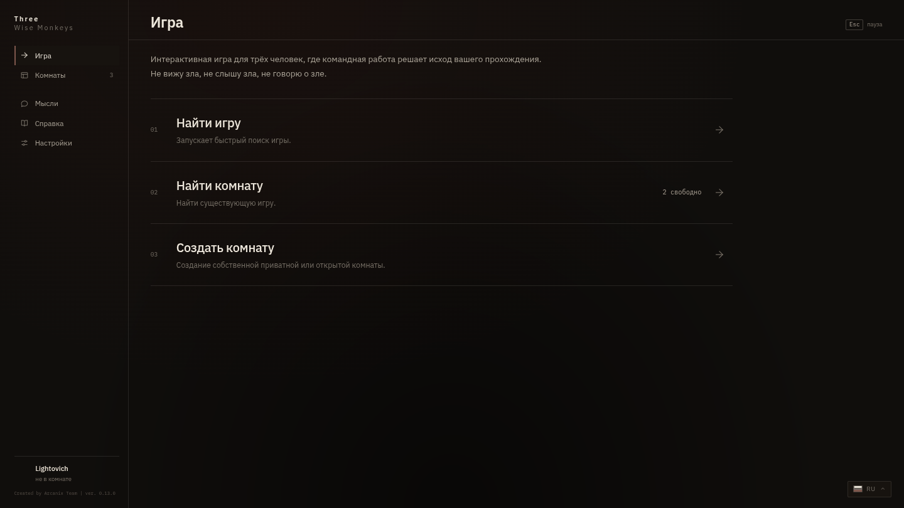
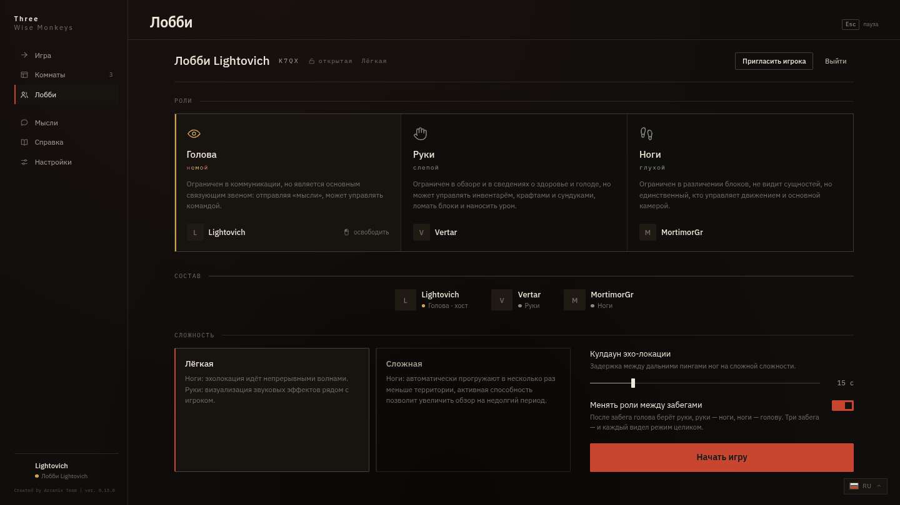
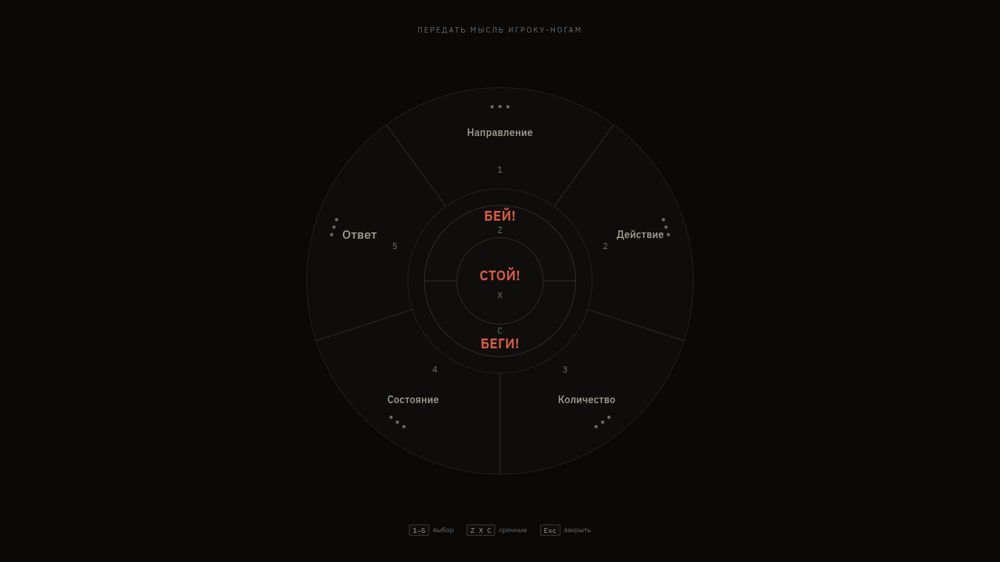
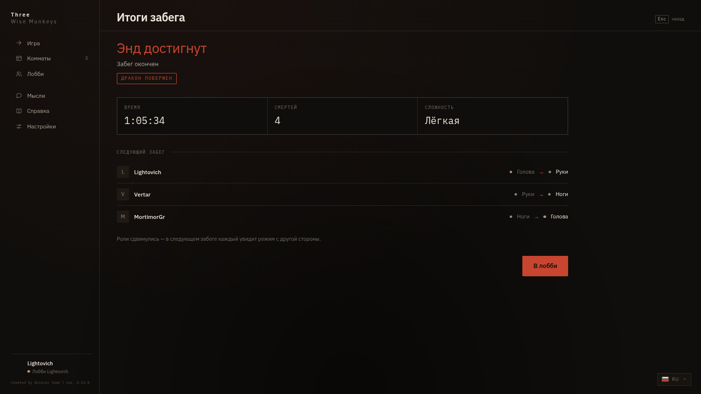
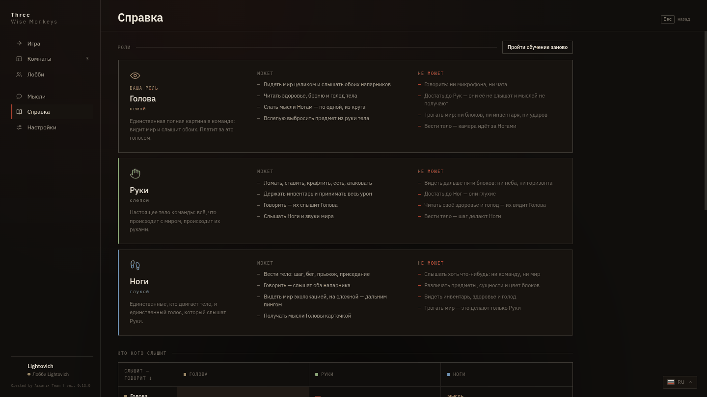

<div align="center">

# Three Wise Monkeys

**A co-op mod for exactly three players who share one character.**

The mod is inspired by the popular allegory "See no evil, hear no evil, speak no evil."

The Head sees and hears but cannot say a word. The Hands are the body itself: they break,
build and fight, but see only five blocks around them. The Legs walk the body, hear no one
and see the world in flashes of echolocation. A run counts as won when the team reaches the
End; killing the dragon is tracked separately.

**🇺🇸 The English translation was created by using AI, if you would like to provide an official translation for plugin, please submit a pull request on GitHub**

**Ниже то же самое по-русски: [русская версия](#русская-версия).**
<br>


<br>

`Minecraft 1.21.1` · `Fabric` · `Java 21` · `LGPL-3.0-or-later`
</div>

---

> [!IMPORTANT]
> ### The mod is supported for one to two months after release
>
> Three Wise Monkeys was made by the Arcanix team and put into open access on a
> non-commercial basis. We want you to genuinely enjoy this mode and have as much fun with
> it as we did. Time for projects like this one, however, is getting scarcer.
>
> While support lasts I go through bug reports and fix problems fast and with real
> involvement. Once support ends there will be no more bug fixes, no new features and no
> port to later versions, and issues and pull requests may stay unanswered.
>
> The mod itself will not break when that happens. It keeps working on Minecraft 1.21.1 as
> released, and the Chromium version is pinned to the build. The one thing that can fail
> later is the download mirror for Chromium, and the manual way around that is described
> below.
>
> If you need the mod to last longer than that, take it under your wing! Rework it for your
> own server, add your own features, give your imagination free rein. Just please do not
> forget about the authorship.


---

## Installation

You need **Minecraft 1.21.1**, **Java 21** and [Fabric Loader](https://fabricmc.net/use/)
0.16 or newer.

1. Install [Fabric API](https://modrinth.com/mod/fabric-api)
2. Put `threewisemonkeys-*.jar` into `mods/`
3. **HIGHLY RECOMMENDED.** Install [Simple Voice Chat](https://modrinth.com/plugin/simple-voice-chat) (the mod runs fine without it, but we built automatic setup for it so that the mode is comfortable to play).

<details>
<summary><b>What the mod brings with it</b></summary>

<br>

Two components are bundled inside the jar (Fabric jar-in-jar, both unmodified):

| Component | What for | License |
| --- | --- | --- |
| [MCEF](https://github.com/CinemaMod/mcef) `2.1.6` | The Chromium that the whole mod interface runs on | LGPL 2.1 |
| [Fantasy](https://github.com/NucleoidMC/fantasy) `0.6.4` | Worlds created and deleted at runtime, which arenas need on a server | LGPL 3.0 |

If you put a separate MCEF or Fantasy jar into `mods/`, the Fabric loader uses it instead of
the bundled copy. You do not have to rebuild the mod for that.

</details>

### Chromium installs itself

The mod interface is a web page rendered in Chromium. The Chromium binaries weigh about
128 MB per platform, so they are not bundled: the mod downloads them on first launch.

The first launch looks like this:

```
Downloading Chromium Embedded Framework   ← ~128 MB, once
Extracting                                ← ~330 MB on disk
Chromium Embedded Framework initialized   ← done
```

After that the mod does not need the network. A marker file sits next to the binaries, and
while it is in place the mod never goes online.

The downloader is written from scratch: resume via `Range`, three rounds of retries,
timeouts, a mirror list and sha-256 verification. The checksums are baked into the build,
because the Chromium version is pinned to the mod version. The expected hash is therefore
known in advance and does not depend on what a mirror serves.

<details>
<summary><b>If Chromium still fails to download</b></summary>

<br>

The mod pulls the archive from the official MCEF CDN. When that does not work — the transfer
breaks, stalls, or the address is blocked — there are two ways around it, and neither needs
a rebuild.

**1. Download the archive yourself and drop it in.** The java-cef build is pinned to the mod
version, so the links are fixed and known in advance:

```
https://mcef-download.cinemamod.com/java-cef-builds/a78e832f9f13c2c688caea3d04d8b84fcd238d94/<platform>.tar.gz
```

| Platform | Direct link | Size |
|---|---|---|
| `windows_amd64` | [windows_amd64.tar.gz](https://mcef-download.cinemamod.com/java-cef-builds/a78e832f9f13c2c688caea3d04d8b84fcd238d94/windows_amd64.tar.gz) | 124 MB |
| `windows_arm64` | [windows_arm64.tar.gz](https://mcef-download.cinemamod.com/java-cef-builds/a78e832f9f13c2c688caea3d04d8b84fcd238d94/windows_arm64.tar.gz) | 124 MB |
| `linux_amd64` | [linux_amd64.tar.gz](https://mcef-download.cinemamod.com/java-cef-builds/a78e832f9f13c2c688caea3d04d8b84fcd238d94/linux_amd64.tar.gz) | 128 MB |
| `linux_arm64` | [linux_arm64.tar.gz](https://mcef-download.cinemamod.com/java-cef-builds/a78e832f9f13c2c688caea3d04d8b84fcd238d94/linux_arm64.tar.gz) | 128 MB |
| `macos_amd64` | [macos_amd64.tar.gz](https://mcef-download.cinemamod.com/java-cef-builds/a78e832f9f13c2c688caea3d04d8b84fcd238d94/macos_amd64.tar.gz) | 122 MB |
| `macos_arm64` | [macos_arm64.tar.gz](https://mcef-download.cinemamod.com/java-cef-builds/a78e832f9f13c2c688caea3d04d8b84fcd238d94/macos_arm64.tar.gz) | 116 MB |

Use whatever works: a browser, a download manager, `curl -C -` (it resumes), another
machine, a VPN. Put the file, keeping its name, into the `twm-cef` folder inside the game
folder:

```
.minecraft/twm-cef/windows_amd64.tar.gz
```

The mod picks the file up from there instead of downloading, and still verifies the
sha-256, so a truncated or tampered archive will not pass. To check it yourself beforehand:
`sha256sum <file>` on Linux and macOS, `Get-FileHash <file>` in PowerShell. The expected
sums for this build:

```
e98c385542620f31a594d6fc3c38ed6bca8a547e24ced982a1339bb3333668be  windows_amd64.tar.gz
9af97d3274976547db58d9fd8db0f8415b855f4f8bd545eba227a20c45a5d353  windows_arm64.tar.gz
426bf70ccc65cbcb752e4c8015eae032d8631e6d406278605223d07d444bf917  linux_amd64.tar.gz
9bcf97d13e37dd62de8f29f21f5b330acc9134daccf1de34d60b4c4530c9175b  linux_arm64.tar.gz
dbaf30cd572d36a3c7aae9092b0cb48a7bce00d781fb082492e2930ee20c3c2c  macos_amd64.tar.gz
18d986c84258ad58e01266665e8f21159a5a01e1cc59a9f027c216864cec8714  macos_arm64.tar.gz
```

**2. Point the mod at your own mirror.** When the archive has to reach many people at once —
a whole team, a whole server — it is easier to host it yourself and write the address into
`config/twm-cef-mirrors.txt`. The file is created on first launch with comments inside.
Addresses are tried top to bottom, and the official one goes last.

A mirror needs two files under the same path layout as the original, on any http server:

```
<address>/java-cef-builds/a78e832f9f13c2c688caea3d04d8b84fcd238d94/<platform>.tar.gz
<address>/java-cef-builds/a78e832f9f13c2c688caea3d04d8b84fcd238d94/<platform>.tar.gz.sha256
```

The simplest mirror is a literal one: download both files from the links above and
reproduce the directory structure on your side.

Until Chromium is installed there is no interface, but the mod stays playable. The team can
be assembled with the `/twm` commands described below. The menu does not lock in this case,
even on a server with `lockMenu: true`, because otherwise the player would be stuck inside
an error screen.

</details>

### Voice chat is optional but highly recommended

[Simple Voice Chat](https://modrinth.com/mod/simple-voice-chat) is installed separately, on
the client **and** on the server. The versions on both sides have to match.

The mod runs without it, but then the team is left with text chat, and nobody manages to
type a warning before the creeper goes off.

Voice permissions per role are enforced by the server: it cancels the Simple Voice Chat
packet events for the roles that must not speak or hear.

| Role | Speaks | Hears |
| --- | :---: | :---: |
| Head (mute) | ❌ | ✅ |
| Hands (blind) | ✅ | ✅ |
| Legs (deaf) | ✅ | ❌ |

The restrictions apply during a run only. In the lobby all three players speak and hear
each other, otherwise they could not agree on who takes which role.

Every lobby gets its own voice group, so teams standing on a shared spawn do not hear each
other.

**The mod configures voice chat itself.** It creates the files that are missing and never
overwrites the ones that already exist. If a value differs from what the mod expects, it
only writes a line to the log:

| File | Key | Value | What for |
| --- | --- | --- | --- |
| `voicechat-server.properties` | `force_voice_chat` | `false` | The mod check on join would kick players who have no voice chat, and role permissions are enforced by the server anyway |
| `voicechat-client.properties` | `onboarding_finished` | `true` | The mode starts with three people talking. A microphone setup wizard on the way in means the run never starts |
| | `muted` | `false` | The microphone is closed by default |
| | `microphone_activation_type` | `VOICE` | Push-to-talk would take a key, and all three players need their keys for movement and interaction |
| | `config_version` | `1` | Without it voice chat treats the config as outdated and resets `onboarding_finished` |

The voice chat menu is bound to `V` by default, the same key as the long echo ping of the
Legs. The mod moves its own voice chat menu to `K` and leaves `V` to the ping.

---

## Roles

| | Sees | Hears | Speaks | What it does |
| --- | :---: | :---: | :---: | --- |
| **Head** | ✅ | ✅ | **❌** | The only one who sees and hears everything. Watches for the team and sends thoughts from a radial menu |
| **Hands** | ⚠️ Limited | ✅ | ✅ | The body itself: breaks, builds, fights, holds the inventory, takes the damage |
| **Legs** | ⚠️ Limited | **❌** | ✅ | Move the body. See the world only as expanding echolocation waves |

Each role only knows what the others pass on. The Head spots a creeper and can send a
thought about it to the Legs. The Legs say it out loud, and the Hands are the ones who hear
it and act. The Hands answer by voice, and the Head hears the answer.

That closes the circle: **Head → thought → Legs → voice → Hands → voice → Head.** The
server checks the permissions, so a modified client cannot shortcut the chain.

---

## Controls

| Key | What it does |
| --- | --- |
| `F4` | Menu: lobby, team, settings, help |
| `B` | Thought wheel (Head only) |
| `G` | Help for your role during a run |
| `V` | Long echo ping (Legs only, hard difficulty only) |
| `LeftAlt` | Free look: hold it to turn the camera away from where the Legs are facing |
| `Q` | Blind drop of the item in the body's hand (Head only) |

All binds are ordinary `KeyBinding` entries. They appear in the vanilla controls screen and
can be reassigned from the mod menu, mouse buttons included.

---

## Playing

<table>
<tr>
<td width="50%"><center>(dev build screenshot, information may have changed)</center></td>
<td width="50%"><center>(dev build screenshot, information may have changed)</center></td>
</tr>
<tr>
<td><b>Find a game</b> puts you into a random open room, or into a queue if there is none. You can also join by code or create your own room, open or password-protected.</td>
<td><b>A lobby for three.</b> Everyone picks their own role. The host sets the difficulty and the echo ping cooldown, then starts the run.</td>
</tr>
<tr>
<td></td>
<td></td>
</tr>
<tr>
<td><b>The thought wheel.</b> The only way the Head can say anything. Category first, then the word. <code>Z</code>, <code>X</code> and <code>C</code> send "HIT!", "STOP!" and "RUN!" from any level of the wheel.</td>
<td><b>Run summary.</b> Time, deaths, whether you reached the End, whether the dragon died, and who played what. Roles shift between runs, so after three runs everyone has played all three.</td>
</tr>
</table>

**The tutorial** opens automatically at the start of every run: five steps about your role,
with diagrams. One button skips it, and it can be reopened from the help screen.

**Help** (`G`) shows what applies to your current role: who hears you, who sees you, and
which keys you have.



### Difficulty

Difficulty changes perception only. Role permissions do not depend on it.

| | Easy | Hard |
| --- | --- | --- |
| **Legs** | Echolocation waves are continuous, the world never disappears | A wave comes from each step, plus a long ping on a key with a cooldown |
| **Hands** | A ring around the crosshair shows what was heard: direction, distance, type of sound | Real sound only |

### Settings

`config/twm.json` holds readability and sound options only: echo brightness and lifetime,
line width, HUD scale, volumes, the timbre of interface sounds, and the language.

Echolocation range and role rules are deliberately not configurable, otherwise a player
would set up an easier game for themselves. The echo ping cooldown is set by the host in the
lobby and applies to the whole team.

The interface language of the mod is independent of the game language: `auto`, `ru`, `en`.

---

## On a server

The mod works in two ways, and they need different settings.

| | Your own world with friends | Dedicated mode server |
| --- | --- | --- |
| Where the run happens | where the team is standing | in a separate arena per team |
| Inventory | untouched | saved, run starts from nothing, items come back |
| Menu | an ordinary screen, `Esc` closes it | opens on join, `Esc` does not let you out into the world |
| Concurrent runs | one | as many as the hardware handles |
| `arena.enabled` | `false` | `true` |

### Arenas

A team gets three worlds of its own on a shared seed: overworld, nether and End. Each has a
2000×2000 block border around the centre. Runs by different teams never overlap.

**The stronghold always falls inside the border.** After the world is created the mod
locates it by seed and places the arena centre accordingly, far enough away that the team
does not land on top of it. The portal frame is empty, and eyes are found the vanilla way, so the
nether is needed and each team has its own.

Portals inside an arena lead to the worlds of the same team. Every arena runs its own dragon
fight. When the run ends the worlds are deleted together with their chunks.

Arenas are switched off with `arena.enabled: false`. The run then happens where the team is
standing, which is the normal way to play with friends in your own world.

### `config/twm-server.json`

The file is created on first launch and never overwritten, so your edits survive a mod
update. `/twm admin reload` re-reads it without restarting the server.

```json
{
  "lobby": {
    "lockMenu": true,
    "autoOpenMenu": true,
    "voidWorld": false,
    "requireMod": false,
    "listedLobbies": 60,
    "listedCandidates": 40
  },
  "arena": {
    "enabled": true,
    "size": 2000,
    "netherSize": 2000,
    "endSize": 2000,
    "keepAfterRun": false,
    "freshStart": true,
    "prewarm": true,
    "prewarmLimit": 4,
    "prewarmIdleSeconds": 120,
    "ownDragon": true
  },
  "run": {
    "voiceLobbyGroups": true,
    "rotateRoles": true,
    "summary": true
  },
  "proxy": {
    "enabled": false,
    "requireToken": true,
    "token": "",
    "debug": false
  },
  "announce": {
    "summaryText": "",
    "buttonLabel": "",
    "buttonServer": "",
    "navLabel": "",
    "navServer": ""
  },
  "limits": {
    "lobbyActionsPerSecond": 8,
    "thoughtsPerSecond": 4,
    "dropsPerSecond": 8,
    "passwordAttempts": 5,
    "passwordWindowSeconds": 60
  }
}
```

<details>
<summary><b>What each key does</b></summary>

<br>

| Key | What it does |
| --- | --- |
| `lobby.lockMenu` | The menu cannot be closed into the world until the run starts. Works only together with arenas and only on a dedicated server. Leaving the server is always possible: `Esc` on the main screen opens the vanilla pause |
| `lobby.autoOpenMenu` | The menu opens by itself, once per connection |
| `lobby.voidWorld` | The lobby lives in a separate empty world instead of the main one. Nobody stands in the main world any more, but it stays: arenas take their generator from it. Works only together with arenas |
| `lobby.requireMod` | A client that has not announced the mod channels within five seconds is sent away with `lobby.modMissingMessage`. Without the mod there is nothing to look at: roles, perception and the whole interface live on the client |
| `lobby.modMissingUrl` | A clickable download link printed under the message. Empty means no link line |
| `lobby.modMissingServer` | Behind a proxy: the network server such a player is moved to instead of being kicked. **A kick behind a proxy shows nothing** — BungeeCord silently drops the player to its fallback server and never displays the reason, so the explanation goes to chat and the player is moved on purpose. Chat survives the switch, so the message is still there on the other server |
| `lobby.listedLobbies` / `listedCandidates` | Length limits for the lists in the state snapshot. The snapshot is sent as a single string in a packet, and a string has a maximum length |
| `arena.enabled` | The main switch for arenas |
| `arena.size` / `netherSize` / `endSize` | Side of the square world border, in blocks |
| `arena.keepAfterRun` | Worlds are unloaded instead of deleted. Useful for debugging; on a live server it leaks disk space |
| `arena.freshStart` | The team enters the arena with an empty inventory and no experience |
| `arena.prewarm` | The arena is raised as soon as the lobby is full and waiting for the host, instead of on the start button |
| `arena.prewarmLimit` | Maximum number of pre-raised arenas. Each one is three live worlds |
| `arena.prewarmIdleSeconds` | How long a lobby keeps a pre-raised arena after it stops being full |
| `arena.ownDragon` | Each arena runs its own dragon fight. Without it vanilla reads the fight state from the shared `level.dat` |
| `run.voiceLobbyGroups` | One voice group per lobby |
| `run.rotateRoles` | Allows the host to enable role rotation between runs |
| `run.summary` | The run summary screen |
| `announce.summaryText` | A line from the server owner on the run summary screen. Empty leaves the screen as it was. The summary is the one moment when all three players look at the same thing: while they are in the lobby the menu covers the chat |
| `announce.buttonLabel` / `buttonServer` | A button next to the summary that sends the player to another server of the proxy network. Needs both keys. `/twm connect` does the same from chat |
| `announce.navLabel` / `navServer` | An item in the menu rail, right under the room list, that sends the player to another server — a way back to the hub while the menu is locked. Needs both keys |
| `proxy.enabled` | The server sits behind a BungeeCord-compatible proxy and takes the player profile from it, instead of building an offline one from the name. Turn it on only with the backend port closed to the world: with forwarding on, a direct connection past the proxy is a login under any name |
| `proxy.requireToken` / `token` | The BungeeGuard secret, the same one the proxy has in `forwarding_secret`. This is what separates a real forward from a forged one, so a connection without it does not pass |
| `proxy.debug` | Writes one line per forwarded login: name, uuid, address, property names. The secret itself never goes to the log |
| `limits.*` | Rate limits for incoming player actions and for lobby password attempts. An honest client never hits them |

</details>

#### Behind a BungeeCord proxy

The mod carries its own player-info forwarding, because on 1.21.1 there is nothing to carry
it for us: FabricProxy stopped at 1.18.1, Fabric Forwarding at 1.17, and FabricProxy-Lite
speaks Velocity modern forwarding only. Without forwarding a proxy network gives every
backend the proxy's own address and an offline UUID built from the name — the same player
ends up with a different identity on every server.

What it does, in the order it happens:

1. Vanilla reads the handshake address as `readString(255)`, and a forward carrying a UUID,
   skin properties and a secret does not fit. The limit is lifted in `PacketByteBuf.readString`
   itself, and only while forwarding is on — the constant lives inside the handshake packet's
   constructor, where a mixin cannot go.
2. The address is split on `\0` into host, player address, UUID and profile properties. The
   data is stored on the connection, and the connection's address is replaced with the
   player's real one — before logs, filters and bans ever see it.
3. On login the profile comes from the forward instead of being derived from the name. The
   BungeeGuard secret is compared and then removed from the properties: it must not travel on
   into a profile that other players can read.

Setup:

```json
"proxy": {
  "enabled": true,
  "requireToken": true,
  "token": "the same value as forwarding_secret on the proxy",
  "debug": false
}
```

On the proxy side use BungeeGuard forwarding (Waterfall and its forks call it
`forwarding_mode: BUNGEEGUARD`, with the secret in `forwarding_secret`).

**Close the backend port to the outside world.** With forwarding on, a direct connection that
bypasses the proxy is a login under any name; the secret check is what stops a forged forward,
and a firewall is what stops everything else. `scripts/proxy-forward-test.py` checks all of it
without a client: no forward, no token, wrong token, correct token, and a forward with a skin
(the last one also proves the 255-byte limit is gone).

### Commands

`/twm` assembles a team from chat. It works without the client mod, which makes it usable
for bots and debugging: `create`, `join`, `list`, `quick`, `leave`, `role`, `difficulty`,
`invite`, `accept`, `start`, `stop`, `connect`.

`connect` sends the player to the server named in `announce.buttonServer` — the chat twin of
the summary button. It is refused during a run: leaving stops the game for all three. All of
`announce` is empty by default, so on a server that does not fill it in nothing is drawn and
the command has nowhere to send anyone: the build is the same for everyone, and each server
invites players only to itself.

`/twm admin` is for the server owner and requires permission level 3. It also works from the
console:

| Command | What it does |
| --- | --- |
| `probe` | Raises a test arena and deletes it. Reports the time taken, the seed, the drop point and the stronghold it found. This is the only way to check arenas before the first player arrives |
| `arenas` | Lists live arenas: lobby code, seed, centre, stronghold, spawn |
| `stop <code>` | Force-stops a run and returns the team |
| `reload` | Re-reads `twm-server.json` |

### What the mod does to a player and how it is undone

A run puts the Head and the Legs into adventure mode, makes them invisible and invulnerable,
and with arenas enabled moves all three into another world. Vanilla saves all of that into
`playerdata`, while the lobby only lives in memory.

So before the run the mod takes a snapshot of the player state and stores it next to the
world: game mode, flags, and on arenas also the inventory, experience, health and the
position the player left from. The snapshot is applied in three cases:

1. the run stops normally;
2. the server shuts down, in which case runs are closed before players are saved;
3. a player joins who has a snapshot but no team.

The third case covers a server crash. Without it, a `kill -9` in the middle of a run would
leave the player invisible and invulnerable for good.

---

## Building from source

```bash
./gradlew build        # → build/libs/threewisemonkeys-*.jar
./gradlew test         # tests on pure logic
./gradlew runClient    # client with the mod
./gradlew runServer    # server with the mod
```

To check that arenas come up on a particular machine you do not need three clients. Run
`/twm admin probe` from the server console.

Dev launches have no voice chat, because recent Simple Voice Chat builds are made with a
newer Loom that ours does not remap. Test it the normal way instead, with the built jar in
`mods/` on both the client and the server.

---

## License

**GNU LGPL 3.0 or any later version**, see [LICENSE](LICENSE).

You are free to fork, modify and distribute the mod. The one condition is that changes to
the mod itself are published under the same license with authorship credited. A mod that
merely depends on this one can pick its own license.

Third-party components and their licenses are listed in
[THIRD-PARTY.md](THIRD-PARTY.md). In short: only MCEF (LGPL 2.1) and Fantasy (LGPL 3.0) are
bundled, both unmodified. Simple Voice Chat is not bundled at all, and the jar contains none
of its classes.

---

## Русская версия

<div align="center">

**Кооперативный мод строго на троих: игроки делят одного персонажа.**

Мод созданный по мотивам популярной аллегории "Не вижу зла, не слышу зла, не говорю о зле"

Голова видит и слышит, но не может сказать ни слова. Руки — это само тело: они ломают,
строят и дерутся, но видят только на пять блоков вокруг. Ноги ведут тело, никого не слышат
и видят мир вспышками эхолокации. Забег считается пройденным, когда команда добралась до
Энда; убитый дракон отмечается отдельно.


<br>

 
<br>

`Minecraft 1.21.1` · `Fabric` · `Java 21` · `LGPL-3.0-or-later`

</div>

> [!IMPORTANT]
> ### Мод поддерживается 1–2 месяца после релиза
>
> Three Wise Monkeys сделан командой Arcanix для публикации в открытый доступ, на некоммерческой основе. Мы хотим чтобы вы дейстительно насладились игрой в этот режим, и повеселились так же, как это сделали мы. Однако сейчас времени на подобные проекты всё меньше. 
>
> Пока поддержка осуществляется я буду разбирать баг-репорты, фиксить проблемы с высокой скоростью и вовлеченностью. Когда
> поддержка заканчится: исправлений багов, новых возможностей, порта на версии выше - не будет, issue и pull request могут остаться без ответа.
>
> Сам мод от этого не сломается. Он продолжит работать на Minecraft 1.21.1 в том виде, в
> котором вышел, а версия Chromium прибита к сборке. Отвалиться со временем может только
> зеркало, с которого качается Chromium, и на этот случай ниже описан ручной способ.
>
> Если мод нужен вам дольше этого срока, берите "под своё крыло"! Переписывайте под свой сервер, добавляйте свой функционал, и дайте волю своей фантазии! Но не забывайте, пожалуйста, об авторстве.

### Установка

Нужны **Minecraft 1.21.1**, **Java 21** и [Fabric Loader](https://fabricmc.net/use/) 0.16
или новее.

1. Поставьте [Fabric API](https://modrinth.com/mod/fabric-api)
2. Положите `threewisemonkeys-*.jar` в `mods/`
3. **КРАЙНЕ РЕКОМЕНДУЕТСЯ.** Поставьте [Simple Voice Chat](https://modrinth.com/plugin/simple-voice-chat) (мод работает стабильно и без него, однако мы специально создали автоматическую настройку этого мода для комфортной игры).

### Роли

| | Видит | Слышит | Говорит | Что делает |
| --- | :---: | :---: | :---: | --- |
| **Голова** | ✅ | ✅ | **❌** | Единственная роль, которая видит и слышит всё. Смотрит за команду и шлёт мысли из кругового меню |
| **Руки** | ⚠️ Ограничено | ✅ | ✅ | Само тело: ломает, строит, дерётся, держит инвентарь, получает урон |
| **Ноги** | ⚠️ Ограничено | **❌** | ✅ | Двигают тело. Мир видят только расходящимися волнами эхолокации |

Каждая роль знает только то, что ей передали остальные. Голова заметила крипера и может
отправить об этом мысль Ногам. Ноги произносят это вслух, и слышат их Руки — те, кто может
что-то сделать. Руки отвечают голосом, и Голова этот ответ слышит.

Круг замыкается: **Голова → мысль → Ноги → голос → Руки → голос → Голова.** Права ролей
проверяет сервер, поэтому изменённый клиент цепочку не срежет.

<details>
<summary><b>Что мод приносит с собой</b></summary>

<br>

Внутрь jar вложены два компонента (механизм Fabric jar-in-jar, оба без изменений):

| Компонент | Зачем | Лицензия |
| --- | --- | --- |
| [MCEF](https://github.com/CinemaMod/mcef) `2.1.6` | Chromium, на котором работает весь интерфейс мода | LGPL 2.1 |
| [Fantasy](https://github.com/NucleoidMC/fantasy) `0.6.4` | Миры, создаваемые и удаляемые на ходу. Нужны аренам на сервере | LGPL 3.0 |

Если положить в `mods/` отдельный jar MCEF или Fantasy, загрузчик Fabric возьмёт его вместо
вложенного. Пересобирать мод для этого не нужно.

</details>

#### Chromium ставится сам

Интерфейс мода — это веб-страница в Chromium. Бинари Chromium весят около 128 МБ на
платформу, поэтому в jar они не вложены: мод скачивает их при первом запуске.

Первый запуск выглядит так:

```
Downloading Chromium Embedded Framework   ← ~128 МБ, один раз
Extracting                                ← ~330 МБ на диске
Chromium Embedded Framework initialized   ← готово
```

Дальше сеть не нужна. Рядом с бинарями лежит метка проверенной установки, и пока она на
месте, мод в интернет не ходит.

Загрузчик написан свой: докачка по `Range`, три круга повторов, таймауты, список зеркал и
проверка sha-256. Контрольные суммы вшиты в сборку, потому что версия Chromium прибита к
версии мода. Эталонная сумма известна заранее и не зависит от того, что отдаст зеркало.

<details>
<summary><b>Если Chromium всё-таки не качается</b></summary>

<br>

Мод скачивает архив с официального CDN проекта MCEF. Если оттуда не идёт — рвётся, висит,
блокируется провайдером, — есть два обхода, и ни один не требует пересборки мода.

**1. Скачать архив самому и подложить его.** Версия java-cef прибита к сборке мода, поэтому
ссылки постоянные и известны заранее. Общий вид:

```
https://mcef-download.cinemamod.com/java-cef-builds/a78e832f9f13c2c688caea3d04d8b84fcd238d94/<платформа>.tar.gz
```

| Платформа | Прямая ссылка | Размер |
|---|---|---|
| `windows_amd64` | [windows_amd64.tar.gz](https://mcef-download.cinemamod.com/java-cef-builds/a78e832f9f13c2c688caea3d04d8b84fcd238d94/windows_amd64.tar.gz) | 124 МБ |
| `windows_arm64` | [windows_arm64.tar.gz](https://mcef-download.cinemamod.com/java-cef-builds/a78e832f9f13c2c688caea3d04d8b84fcd238d94/windows_arm64.tar.gz) | 124 МБ |
| `linux_amd64` | [linux_amd64.tar.gz](https://mcef-download.cinemamod.com/java-cef-builds/a78e832f9f13c2c688caea3d04d8b84fcd238d94/linux_amd64.tar.gz) | 128 МБ |
| `linux_arm64` | [linux_arm64.tar.gz](https://mcef-download.cinemamod.com/java-cef-builds/a78e832f9f13c2c688caea3d04d8b84fcd238d94/linux_arm64.tar.gz) | 128 МБ |
| `macos_amd64` | [macos_amd64.tar.gz](https://mcef-download.cinemamod.com/java-cef-builds/a78e832f9f13c2c688caea3d04d8b84fcd238d94/macos_amd64.tar.gz) | 122 МБ |
| `macos_arm64` | [macos_arm64.tar.gz](https://mcef-download.cinemamod.com/java-cef-builds/a78e832f9f13c2c688caea3d04d8b84fcd238d94/macos_arm64.tar.gz) | 116 МБ |

Качать можно чем угодно: браузером, менеджером загрузок, `curl -C -` (умеет докачку),
с другой машины, через VPN. Скачанный архив положить, не переименовывая, в папку
`twm-cef` внутри папки игры:

```
.minecraft/twm-cef/windows_amd64.tar.gz
```

Мод возьмёт файл оттуда вместо загрузки и всё равно сверит sha-256, так что недокачанный
или подменённый архив не пройдёт. Проверить сумму заранее — `sha256sum <файл>` на
Linux и macOS, `Get-FileHash <файл>` в PowerShell. Эталонные суммы для этой сборки:

```
e98c385542620f31a594d6fc3c38ed6bca8a547e24ced982a1339bb3333668be  windows_amd64.tar.gz
9af97d3274976547db58d9fd8db0f8415b855f4f8bd545eba227a20c45a5d353  windows_arm64.tar.gz
426bf70ccc65cbcb752e4c8015eae032d8631e6d406278605223d07d444bf917  linux_amd64.tar.gz
9bcf97d13e37dd62de8f29f21f5b330acc9134daccf1de34d60b4c4530c9175b  linux_arm64.tar.gz
dbaf30cd572d36a3c7aae9092b0cb48a7bce00d781fb082492e2930ee20c3c2c  macos_amd64.tar.gz
18d986c84258ad58e01266665e8f21159a5a01e1cc59a9f027c216864cec8714  macos_arm64.tar.gz
```

**2. Указать своё зеркало.** Если архив надо раздать сразу многим — например, всей команде
или всему серверу, — проще положить его на свой http-сервер и вписать адрес в
`config/twm-cef-mirrors.txt`. Файл создаётся при первом запуске, внутри есть пояснения.
Адреса мод пробует сверху вниз, официальный идёт последним.

От зеркала нужны два файла по такой раскладке путей — той же, что у оригинала:

```
<адрес>/java-cef-builds/a78e832f9f13c2c688caea3d04d8b84fcd238d94/<платформа>.tar.gz
<адрес>/java-cef-builds/a78e832f9f13c2c688caea3d04d8b84fcd238d94/<платформа>.tar.gz.sha256
```

Проще всего сделать зеркало зеркалом буквально: скачать оба файла по ссылкам выше и
повторить у себя структуру каталогов.

Пока Chromium не установлен, интерфейса нет, но играть можно: команда собирается командами
`/twm`, они описаны ниже. Меню в этом случае не запирается даже на сервере с
`lockMenu: true`, иначе игрок остался бы заперт в экране с ошибкой.


</details>

#### Голосовой чат — не обязателен, но очень рекомендуется

[Simple Voice Chat](https://modrinth.com/mod/simple-voice-chat) ставится отдельно, на клиент
**и** на сервер. Версии на обеих сторонах должны совпадать.

Мод работает и без него, но тогда у команды остаётся текстовый чат, а в нём никто не
успевает напечатать предупреждение раньше, чем взорвётся крипер.

Права ролей на голос выдаёт сервер: он отменяет события пакетов Simple Voice Chat для тех
ролей, которым говорить или слышать не положено.

| Роль | Говорит | Слышит |
| --- | :---: | :---: |
| Голова (немой) | ❌ | ✅ |
| Руки (слепой) | ✅ | ✅ |
| Ноги (глухой) | ✅ | ❌ |

Ограничения работают только в забеге. В лобби все трое говорят и слышат друг друга, иначе
они не договорились бы о ролях.

У каждого лобби своя голосовая группа, поэтому команды на общем спавне не слышат друг друга.

**Настройки голосового чата мод правит сам.** Недостающие файлы он создаёт, существующие не
переписывает никогда. Если значение расходится с нужным, мод только пишет об этом в лог:

| Файл | Ключ | Значение | Зачем |
| --- | --- | --- | --- |
| `voicechat-server.properties` | `force_voice_chat` | `false` | Проверка мода на входе выкидывала бы игроков без голосового чата, а права ролей всё равно выдаёт сервер |
| `voicechat-client.properties` | `onboarding_finished` | `true` | Режим начинается с разговора втроём. Мастер настройки микрофона на входе означает, что забег не начнётся вовсе |
| | `muted` | `false` | По умолчанию микрофон закрыт |
| | `microphone_activation_type` | `VOICE` | Push-to-talk занял бы клавишу, а клавиши нужны всем троим на движение и взаимодействия |
| | `config_version` | `1` | Без него голосовой чат считает конфиг устаревшим и сбрасывает `onboarding_finished` |

Меню голосового чата по умолчанию висит на `V`, там же, где дальний эхо-пинг Ног. Мод
переносит своё меню голосового чата на `K`, а `V` оставляет за пингом.

### Управление

| Клавиша | Что делает |
| --- | --- |
| `F4` | Меню: лобби, команда, настройки, справка |
| `B` | Круг мыслей (только Голова) |
| `G` | Справка по своей роли посреди забега |
| `V` | Дальний эхо-пинг (только Ноги, только на сложной) |
| `ЛевыйAlt` | Свободный обзор: удерживайте, чтобы отвести камеру от направления Ног |
| `Q` | Слепой выброс предмета из руки тела (только Голова) |

Все бинды — это обычные `KeyBinding`. Они видны в ванильных настройках управления, и их можно
переназначить прямо из меню мода, в том числе на кнопки мыши.

### Как играть

<table>
<tr>
<td width="50%"> <center>(старый скриншот, информация может устареть)</center></td>
<td width="50%"> <center>(старый скриншот, информация может устареть)</center></td>
</tr>
<tr>
<td><b>Найти игру</b> отправляет в случайную открытую комнату, а если таких нет — в очередь. Ещё можно войти по коду или создать свою комнату, открытую или с паролем.</td>
<td><b>Лобби на троих.</b> Роль каждый выбирает сам. Хост задаёт сложность и кулдаун эхо-пинга и запускает забег.</td>
</tr>
<tr>
<td></td>
<td></td>
</tr>
<tr>
<td><b>Круг мыслей.</b> Единственный способ Головы что-то сказать. Сначала категория, потом слово. <code>Z</code>, <code>X</code> и <code>C</code> шлют «БЕЙ!», «СТОЙ!» и «БЕГИ!» с любого уровня круга.</td>
<td><b>Итоги забега.</b> Время, смерти, дошли ли до Энда, убит ли дракон, и кто какую роль играл. Между забегами роли сдвигаются, так что за три забега каждый побывает во всех трёх.</td>
</tr>
</table>

**Обучение** открывается само в начале каждого забега: пять шагов про вашу роль, со схемами.
Его можно пропустить одной кнопкой и открыть заново из справки.

**Справка** (`G`) показывает то, что относится к вашей текущей роли: кто вас слышит, кто
видит и какие клавиши у вас есть.


#### Сложность

Сложность меняет только восприятие. Права ролей от неё не зависят.

| | Лёгкая | Сложная |
| --- | --- | --- |
| **Ноги** | Волны эхолокации идут непрерывно, мир не пропадает | Волна идёт от шага, плюс дальний пинг по кнопке с кулдауном |
| **Руки** | Вокруг прицела рисуется кольцо услышанного: сторона, дальность, род звука | Только настоящий звук |

#### Настройки

В `config/twm.json` вынесены только читаемость и звук: яркость и время жизни эха, толщина
линий, масштаб HUD, громкости, тембр звуков интерфейса, язык.

Дальность эхолокации и правила ролей в настройки не вынесены: иначе игрок настроил бы себе
облегчённую игру. Кулдаун эхо-пинга задаёт хост в лобби, и он общий для команды.

Язык интерфейса мода переключается независимо от языка игры: `auto`, `ru`, `en`.

### На сервере

Мод работает двумя способами, и они требуют разных настроек.

| | Свой мир с друзьями | Выделенный сервер-режим |
| --- | --- | --- |
| Где идёт забег | там же, где стоит команда | в отдельной арене на каждую команду |
| Инвентарь | не трогается | сохраняется, забег с нуля, вещи возвращаются |
| Меню | обычный экран, `Esc` закрывает | открывается на входе, `Esc` не выпускает в мир |
| Одновременных забегов | один | сколько выдержит железо |
| `arena.enabled` | `false` | `true` |

#### Арены

Команда получает три собственных мира на общем сиде: оверворлд, незер и Энд. У каждого стоит
граница 2000×2000 блоков вокруг центра. Забеги разных команд нигде не пересекаются.

**Крепость всегда попадает внутрь границы.** После создания мира мод ищет её по сиду и
ставит центр арены так, чтобы команда не высадилась прямо на неё. Рамка портала
пустая, очи ищутся ванильно, поэтому нужен незер, и он у команды свой.

Порталы внутри арены ведут в миры той же команды. Бой с драконом у каждой арены свой. После
забега миры удаляются вместе с чанками.

Арены выключаются ключом `arena.enabled: false`. Тогда забег идёт там же, где стоит команда,
и это обычный способ поиграть с друзьями в своём мире.

#### `config/twm-server.json`

Файл создаётся при первом запуске и никогда не переписывается, поэтому правки переживают
обновление мода. `/twm admin reload` перечитывает его без перезапуска сервера.

```json
{
  "lobby": {
    "lockMenu": true,
    "autoOpenMenu": true,
    "voidWorld": false,
    "requireMod": false,
    "listedLobbies": 60,
    "listedCandidates": 40
  },
  "arena": {
    "enabled": true,
    "size": 2000,
    "netherSize": 2000,
    "endSize": 2000,
    "keepAfterRun": false,
    "freshStart": true,
    "prewarm": true,
    "prewarmLimit": 4,
    "prewarmIdleSeconds": 120,
    "ownDragon": true
  },
  "run": {
    "voiceLobbyGroups": true,
    "rotateRoles": true,
    "summary": true
  },
  "proxy": {
    "enabled": false,
    "requireToken": true,
    "token": "",
    "debug": false
  },
  "announce": {
    "summaryText": "",
    "buttonLabel": "",
    "buttonServer": "",
    "navLabel": "",
    "navServer": ""
  },
  "limits": {
    "lobbyActionsPerSecond": 8,
    "thoughtsPerSecond": 4,
    "dropsPerSecond": 8,
    "passwordAttempts": 5,
    "passwordWindowSeconds": 60
  }
}
```

<details>
<summary><b>Что означает каждый ключ</b></summary>

<br>

| Ключ | Что делает |
| --- | --- |
| `lobby.lockMenu` | Меню нельзя закрыть в мир, пока забег не начался. Работает только вместе с аренами и только на выделенном сервере. Выйти с сервера можно всегда: `Esc` с главного экрана открывает ванильную паузу |
| `lobby.autoOpenMenu` | Меню открывается само, один раз за подключение |
| `lobby.voidWorld` | Лобби живёт в отдельном пустом мире, а не в главном. В главном больше никто не стоит, но он остаётся: с него арены берут генератор. Работает только вместе с аренами |
| `lobby.requireMod` | Клиент, не заявивший каналы мода за пять секунд, выдворяется с текстом `lobby.modMissingMessage`. Без мода смотреть тут не на что: роли, восприятие и весь интерфейс живут на клиенте |
| `lobby.modMissingUrl` | Кликабельная ссылка на скачивание под сообщением. Пустая — строки со ссылкой не будет |
| `lobby.modMissingServer` | За прокси: сервер сети, куда такого игрока переводят вместо кика. **Кик за прокси не показывает ничего** — BungeeCord молча уводит игрока на резервный сервер и причину не выводит, поэтому объяснение уходит в чат, а перевод делается осознанно. Чат переживает переход, так что сообщение остаётся перед глазами и на другом сервере |
| `lobby.listedLobbies` / `listedCandidates` | Ограничение длины списков в снимке состояния. Снимок уходит одной строкой в пакете, а у строки есть предел длины |
| `arena.enabled` | Главный переключатель арен |
| `arena.size` / `netherSize` / `endSize` | Сторона квадрата границы мира в блоках |
| `arena.keepAfterRun` | Миры не удаляются, а выгружаются. Нужно для разбора багов, на живом сервере это утечка диска |
| `arena.freshStart` | Команда входит в арену с пустым инвентарём и нулевым опытом |
| `arena.prewarm` | Арена поднимается заранее, когда лобби укомплектовано и ждёт хоста, а не по кнопке «Начать» |
| `arena.prewarmLimit` | Максимум заранее поднятых арен. Каждая — это три живых мира |
| `arena.prewarmIdleSeconds` | Сколько лобби держит заранее поднятую арену после того, как перестало быть полным |
| `arena.ownDragon` | Свой бой с драконом у каждой арены. Без этого ваниль берёт состояние боя из общего `level.dat` |
| `run.voiceLobbyGroups` | Своя голосовая группа на каждое лобби |
| `run.rotateRoles` | Разрешает хосту включать сдвиг ролей между забегами |
| `run.summary` | Экран итогов забега |
| `announce.summaryText` | Строка от владельца сервера на экране итогов забега. Пустая — экран остаётся прежним. Итоги — единственный момент, когда все трое смотрят в одну точку: пока команда в лобби, меню закрывает чат |
| `announce.buttonLabel` / `buttonServer` | Кнопка рядом с итогами, уводящая на другой сервер сети прокси. Нужны оба ключа. То же самое из чата делает `/twm connect` |
| `announce.navLabel` / `navServer` | Пункт в рейке меню, сразу под списком комнат, уводящий на другой сервер, — дорога обратно в хаб, пока меню заперто. Нужны оба ключа |
| `proxy.enabled` | Сервер стоит за BungeeCord-совместимым прокси и берёт профиль игрока у него, а не считает оффлайн-профиль от ника. Включать только с закрытым от мира портом бэкенда: при включённом форвардинге прямой коннект мимо прокси — это вход под любым ником |
| `proxy.requireToken` / `token` | Секрет BungeeGuard, тот же, что у прокси в `forwarding_secret`. Именно он отличает настоящий форвард от подделки, поэтому соединение без него не проходит |
| `proxy.debug` | Пишет по строке на каждый форвард: ник, uuid, адрес, имена свойств. Сам секрет в лог не попадает |
| `limits.*` | Ограничения частоты входящих действий игрока и попыток ввода пароля. Честный клиент в них не упирается |

</details>

#### За прокси BungeeCord

Мод несёт собственный форвардинг профиля, потому что на 1.21.1 нести его больше нечему:
FabricProxy остановился на 1.18.1, Fabric Forwarding — на 1.17, а FabricProxy-Lite умеет
только Velocity-modern. Без форвардинга сеть с прокси отдаёт каждому бэкенду адрес самого
прокси и оффлайн-UUID, посчитанный от ника, — то есть один и тот же человек получает на
каждом сервере другую личность.

Что происходит, по порядку:

1. Ваниль читает адрес рукопожатия как `readString(255)`, а форвард с UUID, свойствами
   профиля и секретом туда не влезает. Предел снят в самом `PacketByteBuf.readString` и
   только при включённом форвардинге — константа живёт в конструкторе пакета рукопожатия,
   а туда миксин не встаёт.
2. Адрес разбирается по `\0` на хост, адрес игрока, UUID и свойства профиля. Данные
   вешаются на соединение, а адрес соединения подменяется настоящим адресом игрока — до
   того, как его увидят логи, фильтры и баны.
3. На логине профиль берётся из форварда, а не считается от ника. Секрет BungeeGuard
   сверяется и вырезается из свойств: дальше профиль виден другим игрокам, и секрету там
   не место.

Настройка:

```json
"proxy": {
  "enabled": true,
  "requireToken": true,
  "token": "то же значение, что forwarding_secret у прокси",
  "debug": false
}
```

Со стороны прокси нужен режим BungeeGuard (в Waterfall и его форках это
`forwarding_mode: BUNGEEGUARD`, секрет — в `forwarding_secret`).

**Порт бэкенда обязан быть закрыт от мира.** При включённом форвардинге прямой коннект мимо
прокси — это вход под любым ником: проверка секрета отбивает подделку форварда, всё
остальное отбивает фаервол. Проверить всё это без клиента умеет
`scripts/proxy-forward-test.py`: без форварда, без токена, чужой токен, верный токен и
форвард со скином (последний заодно доказывает, что предела в 255 байт больше нет).

#### Команды

`/twm` собирает команду из чата. Работает и без клиентского мода, поэтому годится для ботов и
отладки: `create`, `join`, `list`, `quick`, `leave`, `role`, `difficulty`, `invite`, `accept`,
`start`, `stop`, `connect`.

`connect` уводит игрока на сервер из `announce.buttonServer` — чатовый двойник кнопки на
экране итогов. Во время забега команда отказывает: уход останавливает игру всем троим. Вся
секция `announce` по умолчанию пуста, поэтому на сервере, который её не заполнил, ничего не
рисуется и команде некуда вести: сборка у всех одна, а зовёт к себе каждый сервер сам.

`/twm admin` предназначена для владельца сервера и требует уровня прав 3. Работает и из
консоли:

| Команда | Что делает |
| --- | --- |
| `probe` | Поднимает пробную арену и удаляет её. Показывает время, сид, точку высадки и найденную крепость. Это единственный способ проверить арены до прихода первого игрока |
| `arenas` | Показывает живые арены: код лобби, сид, центр, крепость, спавн |
| `stop <код>` | Принудительно останавливает забег и возвращает команду |
| `reload` | Перечитывает `twm-server.json` |

#### Что мод делает с игроком и как это откатывается

Забег переводит Голову и Ноги в режим приключения, делает их невидимыми и неуязвимыми, а с
включёнными аренами уносит всех троих в другой мир. Ваниль сохраняет всё это в `playerdata`,
а лобби живёт только в памяти.

Поэтому перед забегом мод снимает слепок состояния и кладёт его рядом с миром: игровой режим,
флаги, а на аренах ещё инвентарь, опыт, здоровье и точку, откуда игрок ушёл. Слепок
применяется в трёх случаях:

1. забег остановлен штатно;
2. сервер выключается, и забеги закрываются до сохранения игроков;
3. на сервер заходит игрок, у которого слепок есть, а команды нет.

Третий случай страхует от падения сервера. Без него `kill -9` посреди забега оставил бы
игрока невидимым и неуязвимым навсегда.

### Сборка из исходников

```bash
./gradlew build        # → build/libs/threewisemonkeys-*.jar
./gradlew test         # проверки на чистой логике
./gradlew runClient    # клиент с модом
./gradlew runServer    # сервер с модом
```

Проверить, поднимаются ли арены на конкретной машине, можно без трёх клиентов: командой
`/twm admin probe` прямо из консоли сервера.

В dev-запусках голосового чата нет, потому что свежие сборки Simple Voice Chat собраны новым
Loom, который наш не ремапит. Проверять его нужно обычным способом: готовым jar в `mods/` на
клиенте и на сервере.

### Лицензия

**GNU LGPL 3.0 или любая более поздняя версия**, см. [LICENSE](LICENSE).

Форкать, править и распространять мод можно свободно. Условие одно: изменения самого мода
публикуются под той же лицензией с сохранением авторства. Мод, который просто зависит от
этого, свою лицензию менять не обязан.

Чужие компоненты и их лицензии перечислены в [THIRD-PARTY.md](THIRD-PARTY.md). Коротко: внутрь
сборки вложены только MCEF (LGPL 2.1) и Fantasy (LGPL 3.0), оба без изменений. Simple Voice
Chat не вложен в мод.
